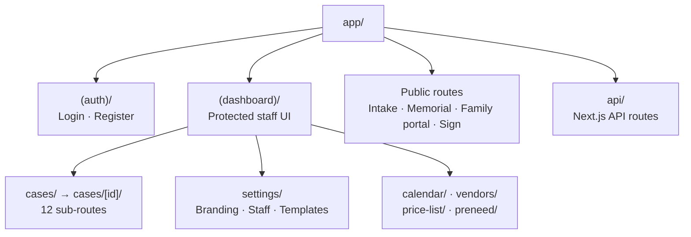
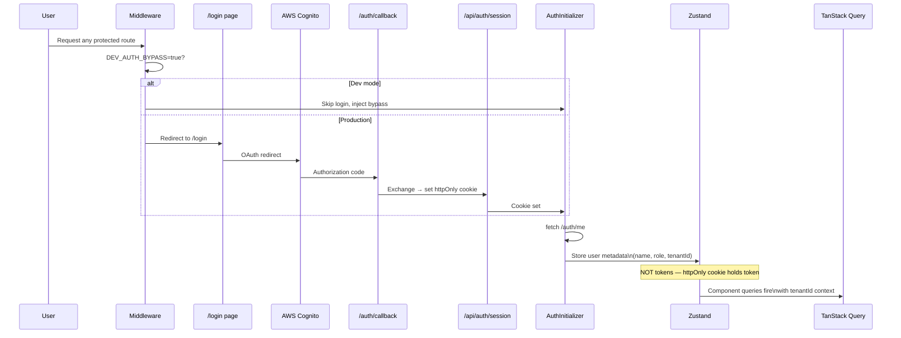

# Kelova Frontend

Next.js 15 App Router frontend for the Kelova funeral operations platform. Multi-tenant — each funeral home gets a subdomain (`sunrise.kelovaapp.com`). Auth via AWS Cognito + Amplify.

- **Local dev:** `http://localhost:3000`
- **Production:** `https://app.vigilhq.com` (Amplify Hosting)
- **Backend API:** `http://localhost:3001` (dev) · `https://api.vigilhq.com` (prod)

---

## Quick Start

```bash
# 1. Install dependencies
npm install

# 2. Copy and populate env
cp .env.example .env.local

# 3. Start dev server (port 3000)
npm run dev
```

`NEXT_PUBLIC_DEV_AUTH_BYPASS=true` (default in `.env.example`) skips Cognito — you land directly on the dashboard as a seeded staff user. No AWS credentials needed locally.

---

## Environment Variables

| Variable                           | Required | Description                                |
| ---------------------------------- | -------- | ------------------------------------------ |
| `NEXT_PUBLIC_API_URL`              | yes      | Backend URL (`http://localhost:3001`)      |
| `API_URL`                          | yes      | Server-side backend URL (same in dev)      |
| `NEXT_PUBLIC_DEV_AUTH_BYPASS`      | dev      | `true` skips Cognito login                 |
| `NEXT_PUBLIC_DEV_TENANT_ID`        | dev      | Tenant ID injected during dev bypass       |
| `NEXT_PUBLIC_COGNITO_USER_POOL_ID` | prod     | From CDK AuthStack output                  |
| `NEXT_PUBLIC_COGNITO_CLIENT_ID`    | prod     | From CDK AuthStack output                  |
| `NEXT_PUBLIC_APP_DOMAIN`           | yes      | `vigilhq.com` (subdomain resolution)       |
| `NEXT_PUBLIC_ENABLE_PWA`           | no       | `false` — enable service worker in Phase 2 |

---

## Architecture

### Route Groups

The `src/app/` directory is organized into four route groups:



> **Generated diagram:** `docs/images/route-tree.png` (`python scripts/generate-diagrams.py`)

### Auth & State Flow



> **Generated diagram:** `docs/images/state-flow.png` (`python scripts/generate-diagrams.py`)

### Middleware (Tenant Resolution)

`src/middleware.ts` runs on every request before React renders:

1. Extracts subdomain from `host` header → sets `x-tenant-slug` request header
2. Dev fallback: reads `?tenant=` query param
3. Dev bypass: redirects `/login` → `/` if `DEV_AUTH_BYPASS=true`
4. Super-admin routes: enforced by backend `RolesGuard` (middleware is UX hint only)

---

## Directory Structure

```
src/
├── app/                    # Next.js App Router (see src/app/README.md)
│   ├── (auth)/            # Login, register, auth callback
│   ├── (dashboard)/       # Protected staff dashboard + all case routes
│   ├── intake/[slug]/     # Public tenant intake form
│   ├── memorial/[id]/     # Public memorial page
│   ├── family/[token]/    # Family portal (public link)
│   ├── sign/[token]/      # E-signature link
│   └── api/               # Next.js API routes (auth session)
│
├── components/             # React components (see src/components/README.md)
│   ├── layout/            # Sidebar, TopBar, PageHeader
│   ├── auth/              # AuthInitializer, AmplifyClientConfig
│   ├── cases/             # CaseTable, CaseOverview, CreateCaseForm
│   ├── dashboard/         # StatCard, RecentCasesTable
│   ├── documents/         # DocumentUpload
│   ├── intake/            # IntakeForm
│   ├── signatures/        # SignatureCanvas
│   ├── tasks/             # TaskItem, TaskList
│   └── ui/               # 23 shadcn/UI primitives
│
├── hooks/                  # Custom React hooks (see src/hooks/README.md)
├── lib/                    # Utilities, API clients, stores (see src/lib/README.md)
│   ├── api/               # Axios clients + 18 domain API modules
│   ├── auth/              # AWS Amplify configuration
│   ├── store/             # Zustand auth store
│   └── utils/             # cn(), format-date
│
├── providers/              # QueryProvider, AuthHydration
├── types/                  # Shared TypeScript types
│   ├── enums/             # 11 enums (CaseStatus, UserRole, etc.)
│   └── interfaces/        # 17 interfaces (ICase, IUser, etc.)
└── middleware.ts           # Tenant resolution + auth guard
```

---

## Key Libraries

| Library               | Version | Purpose                           |
| --------------------- | ------- | --------------------------------- |
| Next.js               | 15.5    | App Router, SSR, API routes       |
| React                 | 19      | UI framework                      |
| TanStack Query        | 5.97    | Server state, caching, refetching |
| TanStack Table        | 8.21    | Headless table for data grids     |
| AWS Amplify           | 6.16    | Cognito auth client               |
| Zustand               | 5.0     | Client auth state store           |
| Tailwind CSS          | 3.x     | Utility-first styling             |
| shadcn/UI + Radix     | —       | Accessible UI primitives          |
| React Hook Form + Zod | —       | Form validation                   |
| Sentry                | —       | Error tracking                    |

---

## State Management

Two stores work together:

| Store        | Library        | Holds                                | Persistence             |
| ------------ | -------------- | ------------------------------------ | ----------------------- |
| Auth store   | Zustand        | User metadata (name, role, tenantId) | localStorage            |
| Server state | TanStack Query | API responses, case data, lists      | In-memory (1 min stale) |

The access token lives in an **httpOnly cookie** — never in Zustand or localStorage. This prevents XSS token theft.

---

## Tests

```bash
npm run test              # Jest unit + component tests
npm run test:coverage     # With coverage (80% threshold)
npm run test:e2e          # Playwright E2E (needs dev server running)
npm run test:e2e:ui       # Playwright with interactive UI
```

Test files:

- `src/__tests__/components/` — 7 component unit tests
- `src/__tests__/acceptance/` — 4 user flow tests (dashboard, intake, payments, follow-ups)
- `e2e/` — 7 Playwright suites (navigation, cases, payments, signatures, calendar, intake, tasks)

---

## Scripts

| Command                               | Description                    |
| ------------------------------------- | ------------------------------ |
| `npm run dev`                         | Dev server on port 3000        |
| `npm run build`                       | Production build               |
| `npm run lint`                        | ESLint                         |
| `npm run type-check`                  | TypeScript check (no emit)     |
| `python scripts/generate-diagrams.py` | Regenerate `docs/images/*.png` |

---

## Multi-Tenancy

Each funeral home gets a subdomain: `sunrise.kelovaapp.com`. The middleware extracts the slug and forwards it as `x-tenant-slug` to API calls. The backend resolves the slug to a `tenantId` and scopes all data accordingly.

For local development, use `?tenant=seed-tenant-id` query param instead of a subdomain.
