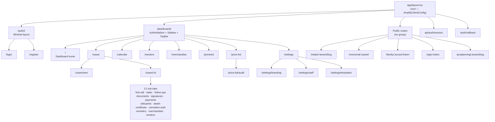

# src/app

Next.js 15 App Router entry point for Vigil. All routing is file-system based. Route groups (`(auth)`, `(dashboard)`) control layout nesting without affecting URL paths.

## Route Groups

### `(auth)/`

Public authentication pages. Uses a minimal layout with no sidebar.

| Route            | File                       | Purpose                                                     |
| ---------------- | -------------------------- | ----------------------------------------------------------- |
| `/login`         | `(auth)/login/page.tsx`    | Cognito-backed sign-in                                      |
| `/register`      | `(auth)/register/page.tsx` | New account creation                                        |
| `/auth/callback` | `auth/callback/page.tsx`   | OAuth redirect handler (outside the group — no auth layout) |

### `(dashboard)/`

Protected staff UI. The group layout (`(dashboard)/layout.tsx`) mounts `AuthInitializer`, `Sidebar`, and `TopBar`. Any child route that renders without a valid Cognito session is redirected to `/login` by the middleware.

### Public routes (no group)

These routes render without any auth layout and are publicly accessible.

| Route                       | Purpose                                        |
| --------------------------- | ---------------------------------------------- |
| `/intake/[tenantSlug]`      | Family intake form — public, per-tenant        |
| `/memorial/[caseId]`        | Public memorial page                           |
| `/family/[accessToken]`     | Family portal — token-gated, no login required |
| `/sign/[token]`             | Document e-signature — token-gated             |
| `/preplanning/[tenantSlug]` | Preplanning inquiry form — public, per-tenant  |

### `api/`

Next.js API routes (server-side only).

| Route              | Purpose                                                                   |
| ------------------ | ------------------------------------------------------------------------- |
| `api/auth/session` | Exchanges Cognito code for a session; sets `access_token` httpOnly cookie |

## Dashboard Sub-Routes

```
(dashboard)/
├── page.tsx                        → /           Dashboard home (stats + recent cases)
├── cases/
│   ├── page.tsx                    → /cases       Case list
│   ├── new/page.tsx                → /cases/new   Create case
│   └── [id]/
│       ├── page.tsx                → /cases/:id   Case overview
│       ├── first-call/page.tsx
│       ├── tasks/page.tsx
│       ├── follow-ups/page.tsx
│       ├── documents/page.tsx
│       ├── signatures/page.tsx
│       ├── payments/page.tsx
│       ├── obituary/page.tsx
│       ├── death-certificate/page.tsx
│       ├── cremation-auth/page.tsx
│       ├── cemetery/page.tsx
│       ├── merchandise/page.tsx
│       └── vendors/page.tsx
├── calendar/page.tsx               → /calendar
├── vendors/page.tsx                → /vendors
├── merchandise/page.tsx            → /merchandise
├── preneed/page.tsx                → /preneed
├── price-list/
│   ├── page.tsx                    → /price-list
│   └── audit/page.tsx             → /price-list/audit
└── settings/
    ├── page.tsx                    → /settings
    ├── branding/page.tsx           → /settings/branding
    ├── staff/page.tsx              → /settings/staff
    └── templates/page.tsx         → /settings/templates
```

## Loading and Error Boundaries

Next.js colocated `loading.tsx` and `error.tsx` files provide automatic Suspense and error boundary wrapping.

| File                                 | Scope                                             |
| ------------------------------------ | ------------------------------------------------- |
| `(dashboard)/loading.tsx`            | Spinner shown while the dashboard layout suspends |
| `(dashboard)/error.tsx`              | Catches unhandled errors in any dashboard route   |
| `(dashboard)/cases/loading.tsx`      | Skeleton shown while the case list loads          |
| `(dashboard)/cases/[id]/loading.tsx` | Skeleton shown while a case workspace loads       |
| `(dashboard)/cases/[id]/error.tsx`   | Error boundary scoped to a single case            |
| `(auth)/error.tsx`                   | Error boundary for auth pages                     |

## Route Tree


