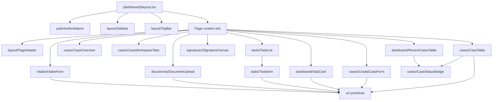

# src/components

All components are client components (`'use client'`) unless noted otherwise. Feature components live in named subdirectories. Shared primitives live in `ui/`.

## Directory Overview

### `layout/`

Navigation shell rendered by the dashboard layout. Not mounted on auth or public routes.

| Component    | Purpose                                                                         |
| ------------ | ------------------------------------------------------------------------------- |
| `Sidebar`    | Fixed left rail with primary nav links and tenant branding                      |
| `TopBar`     | Top bar with breadcrumb, user menu, and mobile nav trigger                      |
| `PageHeader` | Page-level title + optional action slot; used at the top of each dashboard page |

### `auth/`

| Component             | Purpose                                                                                                                                                                             |
| --------------------- | ----------------------------------------------------------------------------------------------------------------------------------------------------------------------------------- |
| `AuthInitializer`     | Mounts inside the dashboard layout. On mount, rehydrates the Zustand store from `localStorage`, then calls `GET /auth/me` to refresh the session. Returns `null` — renders nothing. |
| `AmplifyClientConfig` | Calls `configureAmplify()` once. Lives in the root layout so Amplify is initialized before any auth action. Located at `src/components/amplify-client-config.tsx`.                  |

### `cases/`

All components are client components. Data is fetched via TanStack Query.

| Component           | Purpose                                                                                                                                                                                                                                                                                                        |
| ------------------- | -------------------------------------------------------------------------------------------------------------------------------------------------------------------------------------------------------------------------------------------------------------------------------------------------------------- |
| `CaseTable`         | TanStack Table with sortable columns (Deceased, Status, Assigned, Last Updated), configurable page size (10/25/50), and client-side pagination. Accepts an optional `filter` prop (`active`, `overdue`, `this-month`, `pending-signatures`) passed as a query param. Clicking a row navigates to `/cases/:id`. |
| `CaseStatusBadge`   | Color-coded badge mapped to `CaseStatus` enum values.                                                                                                                                                                                                                                                          |
| `CaseOverview`      | Summary panel showing decedent name, status, stage, primary contact, and assigned staff member.                                                                                                                                                                                                                |
| `CreateCaseForm`    | React Hook Form + Zod schema. Calls `POST /cases` on submit and redirects to the new case detail page.                                                                                                                                                                                                         |
| `CaseWorkspaceTabs` | Tab bar rendered at the top of `/cases/:id`. Provides navigation across all 12 sub-pages. Active tab is derived from the current pathname.                                                                                                                                                                     |

### `dashboard/`

| Component          | Purpose                                                                                                                                                                                    |
| ------------------ | ------------------------------------------------------------------------------------------------------------------------------------------------------------------------------------------ |
| `StatCard`         | Metric tile. Props: `title`, `value`, `icon` (Lucide), optional `delta`, `description`, `href`, and `format` (`number` or `currency`). Wraps itself in a `<Link>` when `href` is provided. |
| `RecentCasesTable` | Displays the 5 most recent active cases. Fetches via `getRecentCases()` (TanStack Query key: `recent-cases`). Includes an empty-state with a copyable intake link.                         |

### `documents/`

| Component        | Purpose                                                                                                                                                   |
| ---------------- | --------------------------------------------------------------------------------------------------------------------------------------------------------- |
| `DocumentUpload` | Handles the S3 presigned PUT flow. Requests an upload URL from the backend, PUTs the file directly to S3, then records the document metadata via the API. |

### `intake/`

| Component    | Purpose                                                                                                           |
| ------------ | ----------------------------------------------------------------------------------------------------------------- |
| `IntakeForm` | Multi-step form for family intake. Public-facing — uses `publicApiClient`. Submits to `POST /intake/:tenantSlug`. |

### `signatures/`

| Component         | Purpose                                                                                                                                 |
| ----------------- | --------------------------------------------------------------------------------------------------------------------------------------- |
| `SignatureCanvas` | Canvas-based signature capture using `react-signature-canvas`. Outputs a base64 PNG on confirm. Used on the `/sign/:token` public page. |

### `tasks/`

| Component  | Purpose                                                                 |
| ---------- | ----------------------------------------------------------------------- |
| `TaskItem` | Single task row with completion toggle, due date display, and assignee. |
| `TaskList` | Renders a list of `TaskItem` components with empty and loading states.  |

### `ui/`

shadcn/UI primitives. Do not add business logic here — these are purely presentational.

`Avatar` `Badge` `Button` `Calendar` `Card` `Checkbox` `Dialog` `DropdownMenu` `Form` `Input` `Label` `Popover` `Select` `Separator` `Sheet` `Skeleton` `StatusPill` `Table` `Tabs` `Textarea` `Tooltip`

## Component Hierarchy

